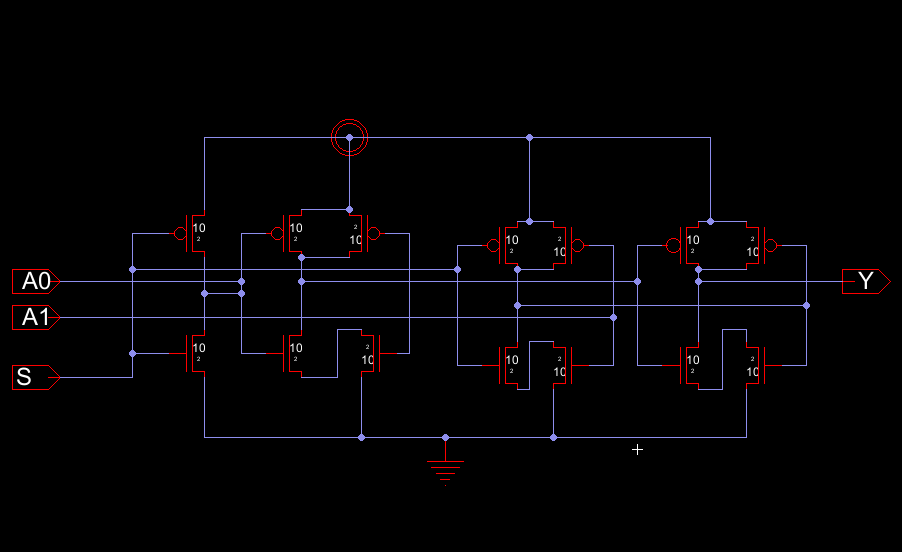
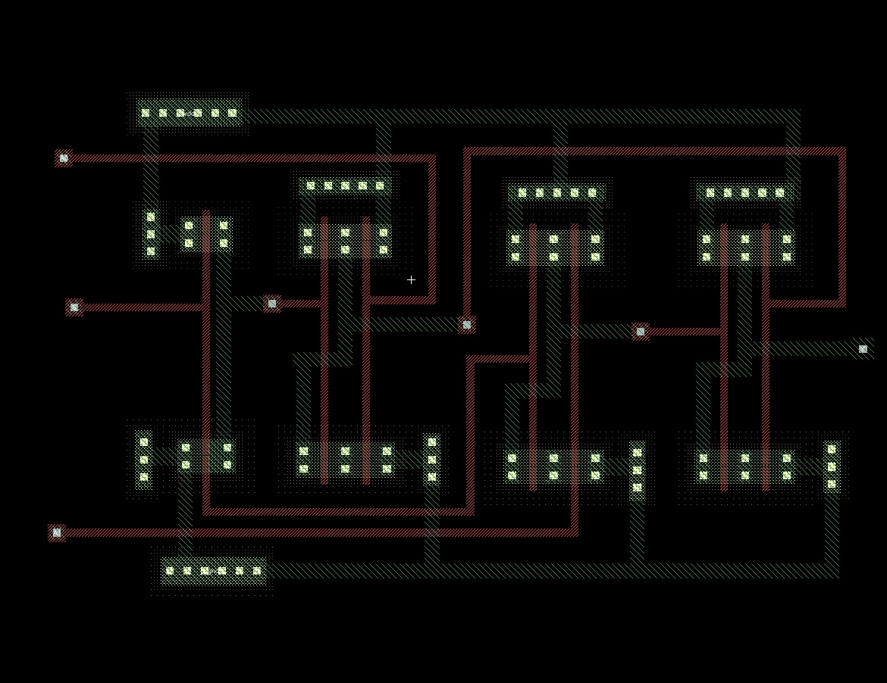
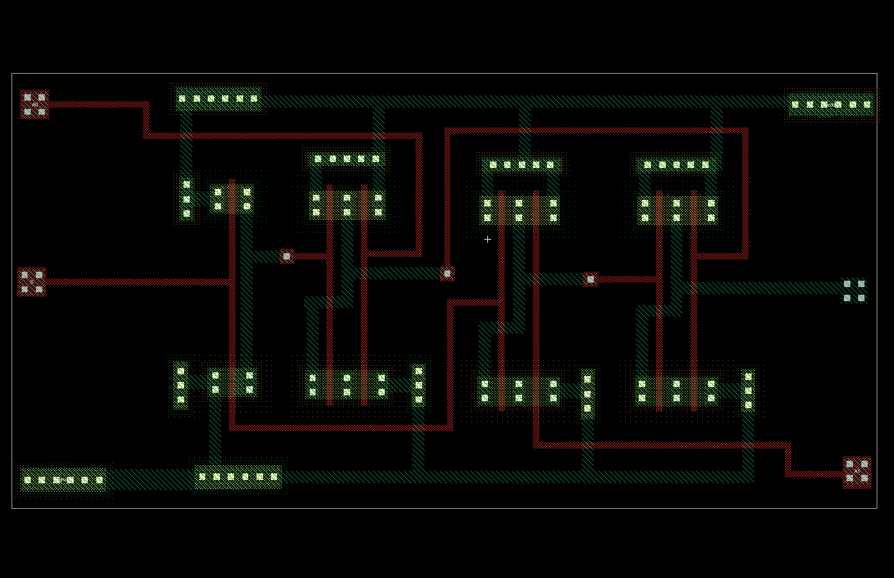

## 2 : 1 Multiplexer

In 2:1 multiplexer, there are only two inputs, $A_0$ and $A_1$ , 1 selection line, $S_0$ and single outputs, Y. On the basis of the combination of inputs at the selection line $S_0$, one of these 2 inputs will be connected to the output.

### Block Diagram


### Truth Table

|$S$|$$A_0$$|$$A_1$$|$Y$|
|-|-|-|-|
|0|0|0|0|
|0|0|1|0|
|0|1|0|1|
|0|1|1|1|
| | | | |
|1|0|0|0|
|1|0|1|1|
|1|1|0|0|
|1|1|1|1|


**The Logical expression of 2 : 1 Multiplexer is -**

$$Y = \overline{S}.A_0 + S.A_1$$

But the simplest form of it is (According to CMOS),

$$Y = \overline{\overline{(A_0.\overline{S}+A_1.S)}}$$

$$=> Y = \overline{[\overline{(A_0.\overline{S})}. \overline{(A_1.S)}]}$$

So, Circuit will be like this :



And the layout :




In IC form (6-pin):




> Use Electric for layout designing<br>
> And LTSpice for simulation


### Important

```bash
vdd vdd 0 DC 5
va A0 0 pulse 5 0 0 10n 10n 1u 2u
vb A1 0 pulse 5 0 0 10n 10n 1u 3u
vc A2 0 pulse 5 0 0 10n 10n 2u 4u
vd A3 0 pulse 5 0 0 10n 10n 2u 2u
vs1 S0 0 pulse 5 0 0 10n 10n 1u 5u
vs2 S1 0 pulse 5 0 0 10n 10n 1u 4u
.trans 20u
.include D:\Electric\projects\C5_models.txt
```

> Use it during simulation

[See VHDL code](./code.vhdl)

<br>

Author :<br>
[Amit Barman](https://abhisandhi.netlify.app/)<br>
ETC undergrad,IIESTS
